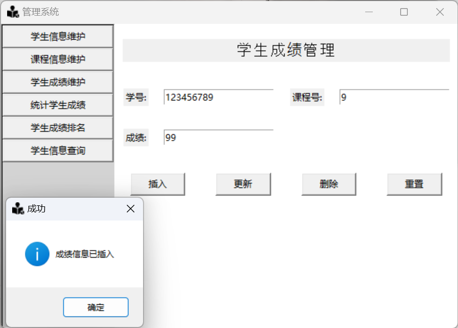

# 数据库实验四——学生管理系统

## 实验要求

1. 实验目的：掌握数据库设计和开发技巧
2. 实验内容：通过一个数据库具体设计实例，掌握数据库设计的方法。
3. 实验要求： 熟练掌握使用 SQL 语句设计数据库的方法，实现前述实验的学生管理系统，完成实验报告。
4. 系统功能要求：
   1. 新生入学信息增加，学生信息修改。
   2. 课程信息维护（增加新课程，修改课程信息，删除没有选课的课程信息）。
   3. 录入学生成绩，修改学生成绩。
   4. 按系统计学生的平均成绩、最好成绩、最差成绩、优秀率、不及格人数。
   5. 按系对学生成绩进行排名，同时显示出学生、课程和成绩信息。
   6. 输入学号，显示该学生的基本信息和选课信息。

## 项目环境

* IDE:PyCharm2023.2.3
* DataBase:GaussDB
* python3.10
* tkinter:提供简单的方式来构建桌面应用程序的界面
* psycopg2:提供操纵Postgresql数据库的能力

## 项目结构

```text
pythonProject [DB_EXP4]
├── postgresSQL
│   ├── __init__.py                # 标识postgresSQL为一个Python包
│   ├── DB_Info.py                 # 包含查询数据库信息的函数
│   ├── Manage_Course_Info.py      # 处理课程信息管理的函数
│   ├── Manage_Grade_Info.py       # 处理成绩信息管理的函数
│   └── Manage_Student_Info.py     # 处理学生信息管理的函数
├── resources
│   ├── icon.ico                   # 图标文件
│   └── login_cover.jpg            # 登录封面图片
├── .gitignore                     # 配置Git忽略哪些文件和文件夹
├── connection_pool.py             # 数据库连接池的实现（在此修改数据库连接信息）
├── main.py                        # 主程序入口文件
├── manage.py                      # 管理应用程序的脚本
├── output.log                     # 输出日志文件
├── README.md                      # 项目说明文件
└── images                         # 项目说明文件的配图
```

## 效果展示

### 登录界面


### 主界面


### 任务1


### 任务2


### 任务3



### 任务4


### 任务5


### 任务6


### 日志文件

同时程序也提供了非常详细的日志文件的信息


